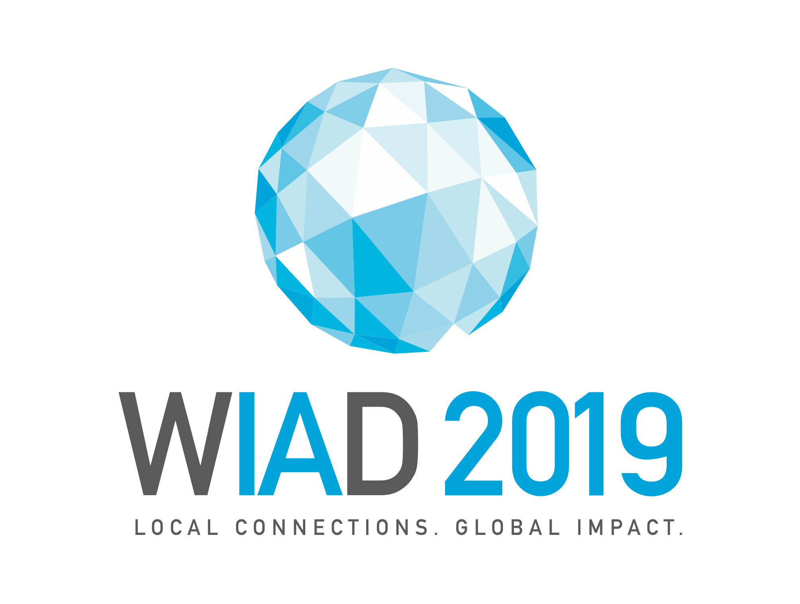

# Resources

## Logos

Add these to your existing promotional materials and make it clear you’re supporting the World IA Day community.

### Primary

| PNG Color on transparent  | (branding/WIAD19/WIAD19 Logos/wiad19logos_primary_color.png)  |
| PNG Grayscale on transparent  | (branding/WIAD19/WIAD19 Logos/wiad19logos_primary_greyscale.png) |

### Secondary

| Greyscale on dark background | 2010 × 1791 | (branding/WIAD19/WIAD19 Logos/wiad19_secondary_greyscale_dark.png)|
| Color on white background | (branding/WIAD19/WIAD19 Logos/wiad19logos_secondary_color.png)|

## Templates

### Planning Templates
- [Google Sheets](https://docs.google.com/spreadsheets/d/1UhHgN5sBw4mg1OFH4Om9L_H7WkYimvYdTvfjwkuryj0/edit?usp=sharing)
- [Airtable](https://airtable.com/shr9Duzt4BGyMnFqB)
- [Trello](https://trello.com/b/G89JhAqo)

### Budgeting
- Budget Template ([XLSX](resources/templates/Budget Template.xlsx), [Google Sheets](https://drive.google.com/open?id=1xzoZakOEnPWtNcXJGPXyeMr4FBkduF_fV-FPRmWLHOA)]

### Sponsorship
- Local Sponsor Agreement Template ([DOCX](resources/templates/Sponsorship/Local Sponsor Agreement Template.docx), ([Google Docs](https://drive.google.com/open?id=1sLRu-6qQ8ayuO58EVBRcrQEpnpy6aAMmOuZqDNEa5KA))
- Local Sponsor Invoice Template ([Google Docs](https://drive.google.com/open?id=1vyTt7ob5eDKWHPVeeJGFl1YZOycsyEn-b9jo-3iTMSQ))

### Social Media Timeline
- [Excel XLSX](resources/templates/Social Media Timeline Template.xlsx)
- [Google Sheets](https://docs.google.com/spreadsheets/d/1CUj-dDC5GT_jNJiF0Ij9YwjespKvM_pVVtdpxL_Xjqk/edit?usp=sharing)

## Presentation Decks

[Keynote](resources/templates/Speakers/WIAD19/WIAD19 Speaker _ Presenter Deck.key)
[Powerpoint](resources/templates/Speakers/WIAD19/WIAD19 Speaker _ Presenter Deck.pptx)

## Social Media Banners

### Speaker Badges

- [PDF](resources/templates/Speakers/WIAD19/WIAD19-SOCIAL_SQUARE_SPEAKER.pdf)
- [Sketch](resources/templates/Speakers/WIAD19/WIAD19-SOCIAL_SQUARE_SPEAKER.sketch)
- [EPS](resources/templates/Speakers/WIAD19/WIAD19-SOCIAL_SQUARE_SPEAKER.eps)

## Name Tags
- [EPS](resources/templates/WIAD_NAMETAGS.eps)
- [Canva] (https://www.canva.com/design/DADCyBluRmA/share?role=EDITOR&token=0ayaURX7irmq6QkSlXZrlQ&utm_content=DADCyBluRmA&utm_campaign=designshare&utm_medium=link&utm_source=sharebutton)

<a href="https://www.canva.com/design/DADCyBluRmA/view?utm_content=DADCyBluRmA&utm_campaign=designshare&utm_medium=embeds&utm_source=link" target="_blank">WIAD19 Name Tag</a> by <a href="https://www.canva.com/producer95?utm_campaign=designshare&utm_medium=embeds&utm_source=link" target="_blank">WIAD Global Executive Producer</a>
